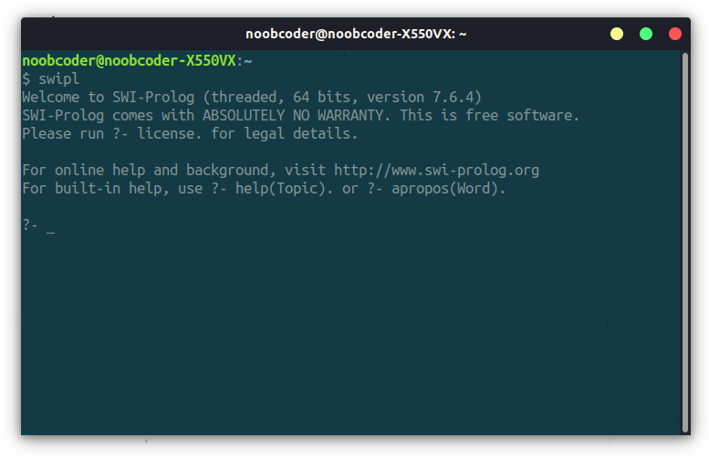
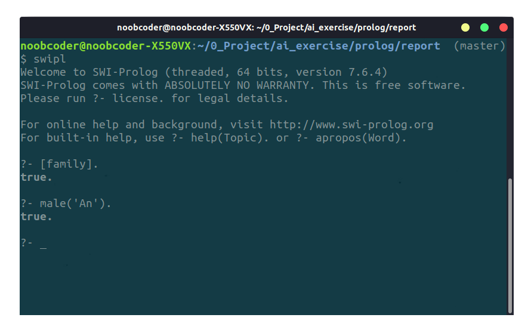
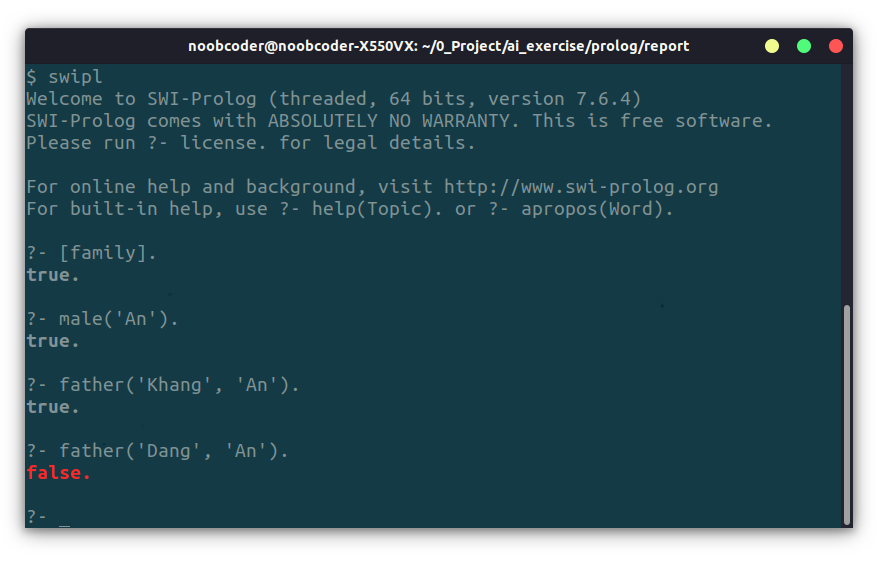
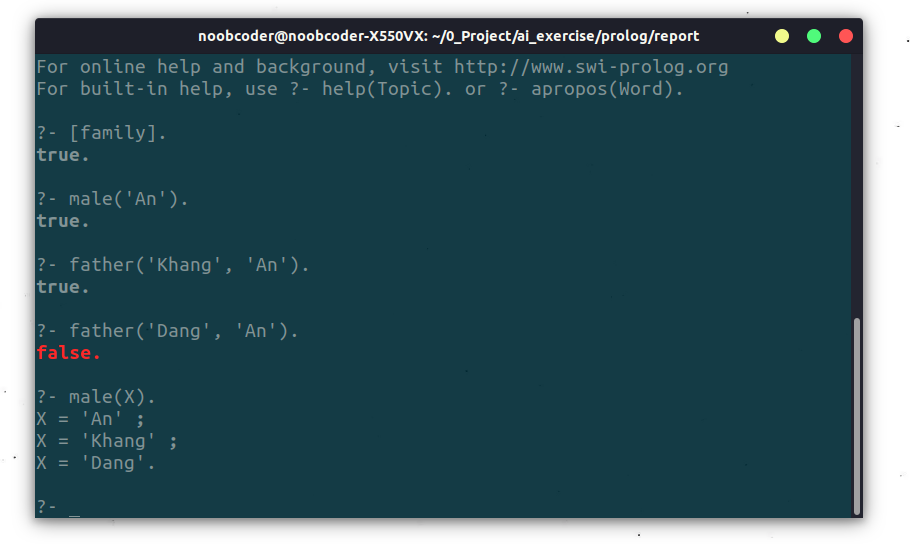
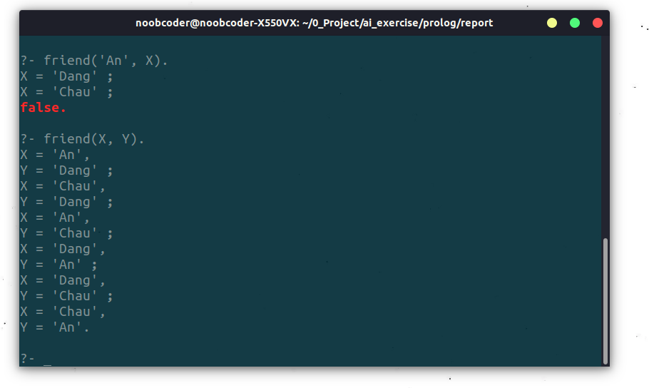
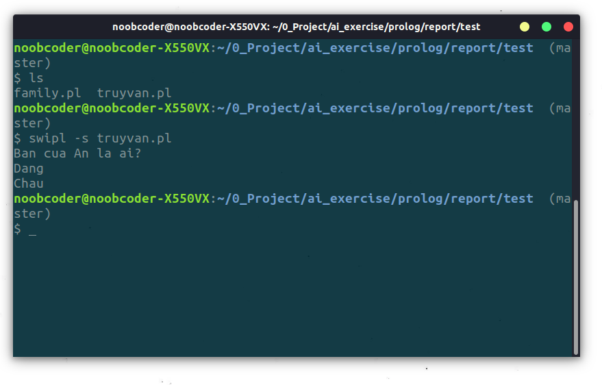

# BÁO CÁO
## Tìm hiểu môi trường thực thi SWI-Prolog

---

## Giới thiệu chung

**SWI-Prolog** là một chương trình cung cấp **môi trường thực thi** cho ngôn ngữ **[Prolog](https://en.wikipedia.org/wiki/Prolog)**. Có rất nhiều và đầy đủ các thư viện cung cấp các **logic ràng buộc**, **đa nhiệm**, **unit testing**, **GUI**(Giao diện đồ họa), và cái API khác cho **Java**, **ODBC**, **Web server**, ... Với lượng document (tài liệu) rộng lớn.

SWI-Prolog miễn phí, có thể chạy được trên các nhóm hệ điều hành Windows, Linux và Unix (MacOS).

SWI-Prolog được phát triển từ năm 1987. Tác giả phát triển chính là **[Jan Wielemaker]()**.

**Các thông tin khác:**

- **Viết trên**: C, Prolog

- **OS**: Cross-platform

- **Loại**: Logic programing

- **Bản quyền**: Simplified BSD, LGPL prior to version 7.3.33

- **Website**: [swi-prolog.org](http://swi-prolog.org)

---

## Cách hoạt động cơ bản

### Bắt đầu chương trình

SWI-Prolog là chương trình hoạt động trên giao diện **command line**. Tương tác trực tiếp với người dùng thông qua command line. Người dùng có thể trực tiếp tạo các facts và rules, và đồng thời truy vấn các Goal đã được định nghĩa sẵn khi chương trình bắt đầu.



Người dùng có thể nạp tri thức (rules & facts) từ file 'pl' lên theo cú pháp:

```prolog
?- consult('tenfile.pl').

% hoặc nếu tên file viết liền
?- consult(tenfile).

% hoặc
?- ['tenfile'].

% hoặc
?- [tenfile].
```

**Lưu ý**: câu lệnh prolog kết thúc bằng dấu `.`.

### Truy vấn

Lấy một ví dụ: Ta có một bộ tri thức sau trong file `family.pl`

```prolog
% family.pl

male('An').
male('Khang').
male('Dang').
female('Linh').
female('Chau').

parent('Linh', 'An').
parent('Khang', 'An').

friendOf('An', 'Dang').
friendOf('Chau', 'Dang').
friendOf('An', 'Chau').

friend(A, B):- friendOf(A, B), friendOf(B, A).
father(F, C):- parent(F, C), male(F).
mother(M, C):- parent(M, C), female(M).
```

* Ta có thể truy vấn các facts:

    *An có phải giới tính nam hay không?*
    

    **Kết quả**: Phải!

* Truy vấn các rules:

    *Khang có phải cha của An hay không?*

    *Đăng có phải cha của An không?*

    

* Để truy vấn các nhiều kết quả theo rules hoặc facts, ta để biến nào đó X (Y , Z ...) vào vị trí mà ta cần truy vấn. Khi truy vấn, để xem kết quả tiếp theo, ta ấn phím `;` (Ấn phím `.` sẽ không hiện thêm kết quả tiếp theo).
    
    *Liệt kê những ai có giới tính nam*
    
    
    **Kết quả**: An, Khang, Dang. 

    *Liệt kê bạn của An*

    *Liệt kê các cặp bạn bè của nhau*

    

    **Kết quả**:
    - Dang, Chau
    - (An, Dang), (An, Chau), (Chau, Dang), (Chau, An), ...

### Thoát
Ta có thể gõ lệnh `halt.` hoặc tổ hợp phím `Ctrl+D` để thoát SWI-Prolog.

---

## Một số hàm hỗ trợ khác sử dụng trong đồ án

### Thao tác với file

SWI-Prolog cũng như Prolog cũng có thể thao tác đọc / ghi file.

```prolog
?-
    open('filename.txt', write, Stream),
    writeln(Stream, 'Hello World'),
    close(Stream).
```

Ta sẽ có ở file `filename.txt`
```
Hello World

```

[Xem chi tiết](http://www.swi-prolog.org/pldoc/man?section=IO)

### Chạy file có sẵn

Ta có thể chạy các truy vấn trong file `.pl` bằng câu lệnh:

```
swipl -s filename.pl
```

Giả sử ta có file `truyvan.pl`:

```prolog
% truyvan.pl
% BAT DAU SCRIPT
:- consult('family'). % load tri thức từ file family.pl

% nếu không có syntax :-, đoạn script sẽ xem như tri thức và không chạy
:-
    writeln('Ban cua An la ai?'),
    forall( % ham ho tro liet ke tat ca ket qua
        friend(X, 'An'),
        writeln(X)
    ).

:- halt.
% Nếu không có halt, chương trình SWI-Prolog sẽ chưa được thoát và trở lại giao diện tương tác.

```

Chạy script: `swipl -s truyvan.pl`



[Xem chi tiết](http://www.swi-prolog.org/pldoc/doc_for?object=manual)
